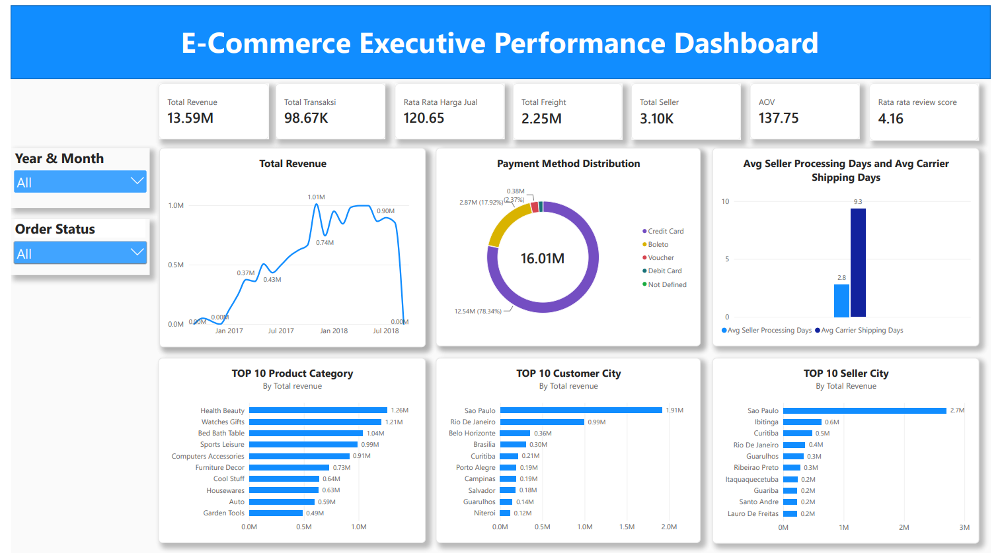

# E-Commerce Executive Performance Dashboard

Dashboard interaktif yang dibangun menggunakan Power BI untuk menyajikan analisis komprehensif mengenai performa bisnis e-commerce. Proyek ini dirancang khusus untuk membantu tim eksekutif memantau metrik utama, tren penjualan, perilaku pembayaran, serta efisiensi logistik pengiriman.

## Ringkasan Dashboard (Key Metrics)

Berdasarkan data keseluruhan, dashboard ini merangkum beberapa indikator performa utama bisnis:
- Total Revenue: 13.59M
- Total Transaksi (Orders): 98.67K
- Average Order Value (AOV): 137.75
- Total Seller: 3.10K
- Rata-rata Review Score: 4.16

## Fitur Utama dan Visualisasi Data

Dashboard ini dibagi menjadi beberapa bagian analisis strategis:
1. Tren Pendapatan: Grafik garis yang memetakan pergerakan pendapatan dari waktu ke waktu (Januari 2017 - Juli 2018) untuk melihat tren musiman.
2. Distribusi Metode Pembayaran: Donut chart yang menunjukkan persentase metode pembayaran yang digunakan oleh pelanggan, di mana opsi utama mendominasi hingga 78.14 persen.
3. Efisiensi Pengiriman (Logistik): Analisis perbandingan performa waktu antara proses internal penjual dan proses pengiriman oleh kurir.
4. Analisis Performa 10 Besar:
   - Kategori Produk: Daftar produk dengan pendapatan tertinggi yang dipimpin oleh Health Beauty dan Watches Gifts.
   - Demografi Wilayah: Pemetaan kota asal pembeli dan penjual potensial yang didominasi oleh wilayah Sao Paulo.
5. Fitur Filter Dinamis: Fasilitas penyaringan data berdasarkan waktu (Year and Month) serta status pesanan (Order Status).

## Wawasan Bisnis dan Analisis Operasional

Melalui visualisasi data yang disajikan, manajemen dapat menjawab pertanyaan strategis berikut:
- Apakah durasi pengiriman kurir selama 9.3 hari terlalu lama? Ya, metrik ini tergolong lama dan menjadi titik sumbat (bottleneck) utama dalam rantai pasok. Penjual sudah bekerja sangat efisien dengan rata-rata waktu proses pesanan hanya 2.8 hari. Masalah utama keterlambatan logistik berada di luar kendali penjual. Hal ini perlu dievaluasi karena pengiriman yang lama dapat menahan skor kepuasan pelanggan yang saat ini berada di angka 4.16 untuk naik lebih tinggi lagi. Terlebih, mayoritas pembeli dan penjual sama-sama terkonsentrasi di wilayah Sao Paulo.

## Rekomendasi Strategis

- Evaluasi Mitra Logistik: Melakukan audit terhadap performa pihak ekspedisi pihak ketiga dan menerapkan Service Level Agreement (SLA) baru guna menekan durasi pengiriman menjadi maksimal 4 sampai 5 hari.
- Optimalisasi Rute Domestik: Memanfaatkan kedekatan geografis antara penjual dan pembeli di wilayah Sao Paulo untuk menyediakan opsi pengiriman jalur cepat.

## Teknologi yang Digunakan

- Sumber Data: E-Commerce Dataset
- Database Engine: PostgreSQL
- Alat Visualisasi: Power BI Desktop

## Tampilan Dashboard

